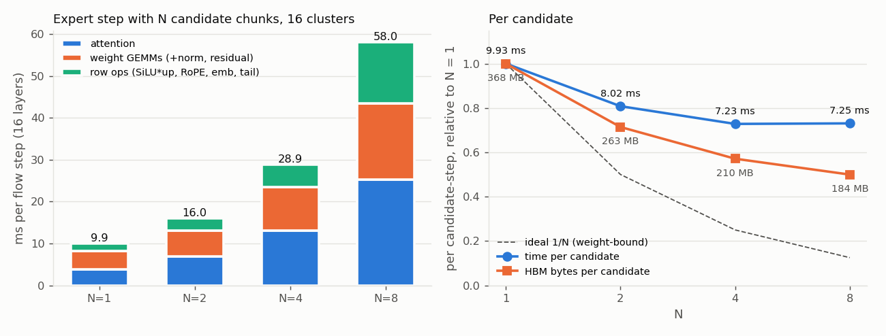
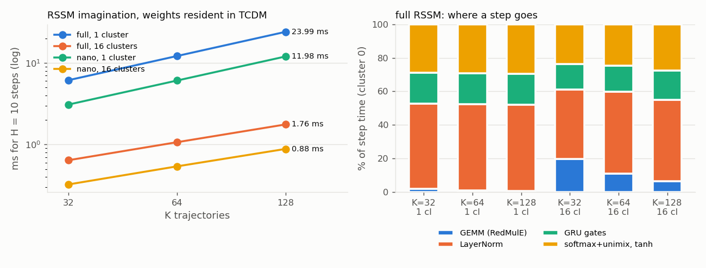

# World model on SoftHier: N expert candidates and on-chip RSSM imagination (W5 ledger)

Branch `agent/w5-world-model`. The hardware side of "imagine N candidates and verify"
(`AI_AGENT/SmolVLA/ttt_memory_worldmodel.md` §4, `research_plan_2026-10.md` W5). Two kernels:

1. **Expert candidate batching**: the SmolVLA action expert denoises N action chunks at once
   (`S_q = 50 N` query rows; shared prefix KV and weights; per-candidate causal masks).
2. **On-chip RSSM imagination**: a DreamerV3-style RSSM + actor with all weights resident in one cluster's TCDM,
   K trajectories x H steps, trajectories dealt over the clusters.

All numbers: gvsoc, 16 clusters (4 x 4), 1 GHz (cycles = ns), ideal HBM, fast ISS libraries, 2026-10-08/09.
Cost model entries: `softhier_mlir/dse/cost.py` (`expert_step_est`, `expert_step_traffic`, `wm_rssm_est`).
Figures: `python tools/world_model_plots.py`.

## 1. Expert with N candidate chunks

### What runs
| piece | change |
|---|---|
| `softhier.cross_attention ... {n_batch = N}` -> `sh_x_attention_n` (`runtime/sh_expert.inc.c`) | q / own k / own v / o hold N blocks of 50 rows. Per query head the prefix K / V (241 rows) is staged and transposed **once**; on self layers the head runs N passes, pass c over `[prefix ; own block c]` (same `Lpad = 320` scores width as N = 1), so candidate c never sees another candidate's keys. Cross layers (prefix keys only) run all `50 N` rows in one pass. |
| `emit_flow(n_cand=N, x0=...)` (`frontend/smolvla_expert.py`) | activations `[50 N, .]`; RoPE tables repeated per candidate; `x0` = the candidates' noise (`cand_noise`: candidate 0 lerobot's noise, candidate c `default_rng(c)`); the time-bias row broadcast as before |
| `batch_tiles(N)` | every step GEMM gets `tm = 50 N` (one row tile, each weight tile streamed once per step whatever N is); `tn` unchanged (same number of output tiles dealt to the 16 clusters); `tk` shrinks only where the double-buffered scratch would exceed the TCDM (N = 8: qkv / t / out 720 -> 360, o 960 -> 480) |
| `tests/gvsoc/expert.py flow --cands N [--seeds ...] [--save-x f.npz]` | per-candidate check against the fp16-floor twin run on that candidate's noise alone (and lerobot for candidate 0 at 16 layers) |

The WIP kernel of the interrupted attempt (commit 2611d31) was kept unchanged after review: scores are re-zeroed per
pass (RedMulE accumulates), the causal own columns a core enabled in pass c-1 are reset before pass c, own K is
transposed into the `kT` columns behind the prefix and own V copied behind the prefix rows per pass, the padding
columns stay zero.

### Correctness
* **N = 2 is bit-identical to two independent N = 1 runs** (noise lerobot and seed 1; 2 steps, 4 layers; every element of
  `x_1`, `x_2` of both candidates; `tools/cmp_cands.py` on the `--save-x` files). This also proves the per-candidate causal mask: one
  cross-candidate key would change candidate 1's numbers. (N = 2 and N = 4 keep every `tk`, so the per-row RedMulE
  accumulation order is the N = 1 one.)
* N = 4 and N = 8 (2 steps, 4 layers): every candidate within 0.0029-0.0059 of its own fp16-floor twin
  (the N = 1 run is 0.0039-0.0044 from it).
* N = 4, 16 layers, real weights: steps 1-7 of candidate 0 match lerobot with the same per-step error as the N = 1 run
  (0.0029 0.0032 0.0042 0.0055 0.0059 0.0046 0.0054); candidates 1-3 within 0.0063 of their twins. Both attempts of the
  full 10-step run were OOM-killed by the host (7 GB shared with other agents' simulations; `dmesg`) after step 7 and
  step 2; the step time is deterministic (28.923 / 28.918 ms for every step of both attempts).

### Cost per flow step (16 layers)


| N | ms / step | ms / candidate-step | attention | weight GEMMs (+norm, residual) | row ops (SiLU*up, RoPE, emb, tail) | HBM MB / step | HBM MB / candidate |
|---|---|---|---|---|---|---|---|
| 1 | 9.93 | 9.93 (1.00) | 3.87 (39 %) | 4.27 (43 %) | 1.79 (18 %) | 368 | 368 (1.00) |
| 2 | 16.04 | 8.02 (0.81) | 6.91 (43 %) | 6.13 (38 %) | 3.01 (19 %) | 525 | 263 (0.71) |
| 4 | **28.92** (measured, 16 L) | 7.23 (0.73) | 13.02 (45 %) | 10.40 (36 %) | 5.49 (19 %) | 840 | 210 (0.57) |
| 8 | 58.03 | 7.25 (0.73) | 25.35 (44 %) | 18.13 (31 %) | 14.55 (25 %) | 1470 | 184 (0.50) |

N = 1: the 16-layer profile of docs/SMOLVLA_EXPERT.md (9.96 ms measured). N = 4: the 16-layer runs above.
N = 2 / 8: 4-layer 2-step profiles (`--steps 2 --layers 4 --profile`: 2.88 / 4.53 / 7.90 / 15.66 ms per 4-layer step at
N = 1 / 2 / 4 / 8) with the GEMM entries scaled by the 16-layer / 4-layer ratio measured at N = 1 and N = 4
(the 4-layer runs read the GEMMs 13-27 % slow; attention, SiLU, RoPE agree within 1 %). HBM bytes are counted from
the program (every DMA the library issues: `cost.expert_step_traffic`), not by a simulator counter.

Per-op at N = 4 (16 layers, per layer call): attention 814 us, silu*up 258, gate/up 188, down 184, q/qkv 169,
o_proj 109, rope 59; emb 320 us and tail 100 us per step.

**Conclusion (expert).** Batching N candidates saves only 19-27 % per candidate, so N candidates cost about 0.73 N
single-chunk latencies (N = 4: 2.9x, N = 8: 5.8x; a 10-step chunk of 8 candidates is 580 ms vs 99 ms). The
"memory stays constant, compute is free" picture of §4.2 does not hold on this machine for two reasons: (a) the
step is not weight-bound; 82 % of an N = 1 step is attention (fetch-bound fp16 softmax on 3 Snitch cores per head) and
row ops, which grow linearly with N, while only the weight GEMMs amortise (4.27 -> 18.1 ms for 8x the rows);
(b) the weight bytes (195 MB / step) are constant, but each GEMM output tile re-streams its X panel from HBM (qkv 25x,
o / down 15x, gate/up 16x), so activation traffic grows with N and dominates from N = 2 (127 -> 1017 MB). Levers, in
order: the attention softmax (40-45 % at every N); X multicast to the clusters that share a row panel (the SUMMA
broadcast path) to make activation traffic N-independent; balanced row blocking in `sh_rowop` (at N = 8 the 400-row
SiLU splits into 21-row blocks, 20 blocks on 16 clusters, so the critical cluster does 42 rows instead of 25:
silu 750 us vs ~460 balanced).

## 2. On-chip RSSM imagination (`runtime/sh_wm.inc.c`)

### Model and kernel
`world-model-on-edge/wm/rssm.py` (bit-exact on GAP9 through Deeploy): MLP encoder, LayerNorm-GRU (update bias - 1),
categorical latent (stoch x classes, softmax + unimix 0.01), ReLU MLPs with LayerNorm (eps 1e-3), actor head tanh.
Trained weights `models/rssm_{step,nano}_trained` (obs 51, act 3):

| config | deter | stoch x classes | hidden / units | blob (imagination / + posterior) | MAC per trajectory-step |
|---|---|---|---|---|---|
| full (`rssm_step`) | 128 | 16 x 16 | 128 | 499 KB / 678 KB fp16 | 247 296 |
| nano | 64 | 8 x 8 | 64 | 102 KB / 142 KB | 49 920 |

`sh_wm_rssm(cfg, blob, h0, z0, a0, obs, hs, zs, as, cluster)`: the DM core stages the blob (offset table + fp16
`[in, out]` matrices, padded rows for act / obs) once per participating cluster; trajectories are dealt over the
clusters (`SH_ALL`: cluster c owns rows `[c Kc, (c+1) Kc)`); each cluster runs H steps of
`(h, z) <- prior(h, z, a); a <- tanh(actor(z, h))` (or `rssm.step` with `posterior = 1`) on TCDM only.
Every concatenation of rssm.py is a column range of one packed RedMulE operand (`[z | a]`, `[x | h]`, `[z' | h']`,
`[h' | embed]`), so the 7 GEMMs per step are single RedMulE triggers with `m` = rows of the cluster; the GRU writes
`h'` straight into the three operands that read it. Row kernels (fp16 SIMD, work split over the 3 cores):
LayerNorm(+ReLU) with a SIMD x16-prescaled variance recount for near-constant rows (no scalar fallback), GRU gates
(`sig = 1/(1+2^-x log2e)`, `tanh = (1-e)/(1+e)`), per-group softmax + unimix, actor tanh. Host: `frontend/wm_rssm.py`
(`prepare` runs the torch module; `pack`; numpy twins in fp32 and fp16-floor); test `tests/gvsoc/wm.py`.

### Correctness (trained weights, vs the torch module; max abs over 512 sampled h / z and 384 a per step)
| run | step 1 h / z / a | worst over H = 10 (open loop) | fp16-floor twin, same samples |
|---|---|---|---|
| full, K = 32, 1 cluster, imagination | 0.0032 / 0.0017 / 0.0024 | z 0.028 (step 8), h 0.016 | z 0.030, h 0.021 |
| full, K = 128, 16 clusters | 0.0017 / 0.0009 / 0.0022 | a 0.041 (step 8), h 0.023 | a 0.037, h 0.032 |
| nano, K = 32, 1 cluster | 0.0013 / 0.0012 / 0.0014 | a 0.023 (step 10) | a 0.021 |
| full, K = 32, posterior step (`RSSM.step`) | 0.0032 / 0.0026 / 0.0041 | (H = 1) | 0.0032 / 0.0029 / 0.0047 |

One step is at the fp16 floor (~1e-3 to 4e-3); the open-loop rollout drifts exactly like the fp16 numpy twin of the
same algebra (the twin is itself 0.017 from torch after 10 steps): the drift is fp16 state, not a kernel error.

### Cost (H = 10, record every step)


| config | K | clusters | ms for H = 10 | us per step | GEMM | LayerNorm | GRU gates | softmax + head | MAC / cycle |
|---|---|---|---|---|---|---|---|---|---|
| full | 32 | 1 | 6.14 | 607 | 1.8 % | 50.9 % | 18.3 % | 29.0 % | 13 |
| full | 64 | 1 | 12.14 | 1203 | 1.0 % | 51.5 % | 18.4 % | 29.1 % | 13 |
| full | 128 | 1 | 23.99 | 2381 | 0.6 % | 51.5 % | 18.5 % | 29.4 % | 13 |
| full | 32 | 16 | 0.64 | 52 | 19.8 % | 41.2 % | 15.2 % | 23.8 % | 123 |
| full | 64 | 16 | 1.07 | 94 | 11.0 % | 48.7 % | 15.4 % | 24.8 % | 148 |
| full | 128 | 16 | **1.76** | 163 | 6.4 % | 48.5 % | 17.5 % | 27.6 % | 180 |
| nano | 32 | 1 | 3.09 | 303 | 1.9 % | 54.6 % | 18.5 % | 25.0 % | 5 |
| nano | 128 | 1 | 11.98 | 1181 | 0.7 % | 55.3 % | 18.7 % | 25.3 % | 5 |
| nano | 32 | 16 | 0.33 | 28 | 17.8 % | 44.7 % | 15.2 % | 22.3 % | 49 |
| nano | 128 | 16 | 0.88 | 83 | 6.2 % | 52.0 % | 17.5 % | 24.2 % | 72 |

ms = ROI of the call (weight staging + 10 steps + recording; 16 clusters: the slowest cluster). Shares: cluster 0's
compute phases. Weight staging: 8.4 K cycles on one cluster, ~0.1 ms when 16 clusters stage 499 KB each at once
(ROI minus cluster 0's phases). `cost.wm_rssm_est` reproduces the table within 10 % (GEMMs with `redmule_cycles`,
row kernels at the fitted 11.0 / 27.5 / 21.5 cycles per output element for LN / GRU / softmax).
For reference, GAP9 (Deeploy, FP32, 8 cores) runs one K = 32 imagination step in 1.25 M cycles = 3.4 ms at 370 MHz;
one SoftHier cluster takes 0.61 ms, 16 clusters 0.052 ms.

**Conclusion (RSSM).** The weight-stationary RSSM never touches HBM inside the rollout and the whole K = 128 x H = 10
imagination costs 1.76 ms on 16 clusters (0.88 ms nano), 1.8 % of one N = 1 expert chunk (99 ms). It is not
GEMM-bound: RedMulE does the 247 K MAC per trajectory-step in 1-20 % of the time, and LayerNorm (41-55 %), the
categorical softmax (22-29 %) and the GRU gates (15-19 %) on the fetch-bound Snitch cores (11 / 21.5 / 27.5 cycles per
element) set the cost, linear in the rows per cluster. Dealing trajectories over clusters is therefore the lever that
works (13.6x for K = 128 on 16 clusters); the GEMM-only floor is ~0.1 ms for H = 10 at any K <= 128 / cluster. Further
levers: a features x trajectories layout (reductions across rows become lane-wise SIMD adds, no horizontal sums), or
a small vector/SFU unit for LN / exp next to RedMulE.

## 3. Verdict for the GPU-side study (A2)
* **WM imagination is free at this scale**: K = 128 imagined trajectories x 10 steps of the full RSSM = 1.76 ms on 16
  clusters (<2 % of an expert chunk); A2 can sweep K up to 128 and H to 10 without a hardware argument against it.
  (Weights must stay <= ~0.5 MB fp16 per cluster for the stationary scheme; a 4x larger RSSM would need a split.)
* **Expert candidates are not free**: N candidates cost ~0.73 N chunk latencies for N >= 4 (N = 2: 1.62x,
  N = 4: 2.91x, N = 8: 5.84x). For A2's N-benefit curve, price N candidates at `expert_step_est(N)`, i.e. the success
  gain from N = 4 must pay for ~3x the denoising latency (~290 ms per 50-action chunk at 16 clusters), unless the
  candidates are made cheaper (shared early flow steps, fewer steps per candidate, or the attention / X-multicast
  levers above).
* Cheapest verify scheme on this hardware: one expert chunk + K RSSM rollouts of perturbed / alternative action
  sequences (cost ~ 1 chunk + 2 %), rather than N full expert candidates.

## 4. Reproduce
```bash
# expert (venv; /app/models/smolvla_base/expert.npz)
.venv/bin/python tests/gvsoc/expert.py flow --steps 2 --layers 4 --profile --cands 4 --save-x n4.npz
.venv/bin/python tests/gvsoc/expert.py flow --steps 2 --layers 4 --profile --seeds 1 --save-x n1_s1.npz   # single candidate, seed 1
# RSSM (prepare with the system python: torch)
python3 -m softhier_mlir.frontend.wm_rssm prepare --model step --K 128 --H 10 --out /app/models/wm_rssm/rssm_step.npz
.venv/bin/python tests/gvsoc/wm.py --npz /app/models/wm_rssm/rssm_step.npz --K 128 --H 10 --cluster all
.venv/bin/python tests/gvsoc/wm.py --npz /app/models/wm_rssm/rssm_step.npz --K 32 --H 1 --posterior
.venv/bin/python tests/gvsoc/wm.py --npz /app/models/wm_rssm/rssm_step.npz --H 10 --sweep 32,64,128 --cluster 0,all
.venv/bin/python tests/gvsoc/wm.py ... --debug        # step-0 intermediates slot by slot vs the fp16 twin
```
